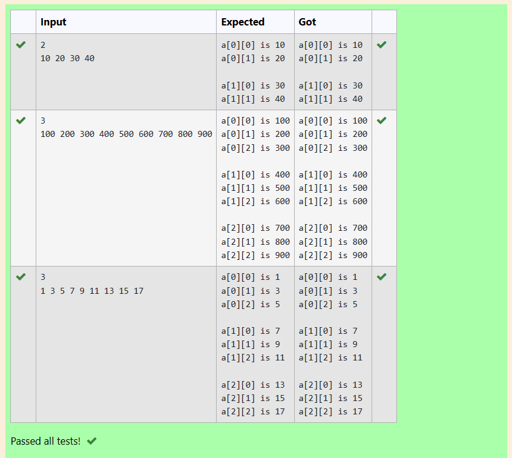

# EX3(C)Array
Developed by: ARSHITHA MS

Register number: 212223240015
 ## AIM:
 To write a program to print elements of a matrix and to print only the even numbers in a matrix.

 ## ALGORITHM:
 1.Start the program

 2.Declare the variables

 3.Get input from the user using for loop.

 4.Use if condition to check if the number is even.
 
 5.Print the output using for loop.

 6.End the program

 
 ## PROGRAM
 ### Program 1(Print elements of matrix):
 ```
#include<stdio.h>
int main()
{
    int n,i,j;
    scanf("%d",&n);
    int a[3][3];
    for(i=0;i<n;i++)
    {
        for(j=0;j<n;j++)
        scanf("%d",&a[i][j]);
    }
    for(i=0;i<n;i++)
    {
        for(j=0;j<n;j++)
        printf("a[%d][%d] is %d\n",i,j,a[i][j]);
        printf("\n");
    }
    
}
```
### Program 2(Print only even numbers):
```
#include <stdio.h>
int main()
{
    int n,i,j;
    scanf("%d",&n);
    int a[3][3];
    for(i=0;i<n;i++)
    {
        for(j=0;j<n;j++)
        {
            scanf("%d",&a[i][j]);
        }
    }
    for(i=0;i<n;i++)
    {
        for(j=0;j<n;j++)
        {
            if(a[i][j]%2==0)
            printf("a[%d][%d] is %d\n",i,j,a[i][j]);
        }
        printf("\n");
    }
}
```

## OUTPUT:
### Output 1:



### Output 2:


## RESULT:
Thus the program to print elements of a matrix and to print only the even numbers in a matrix is executed successfully.
